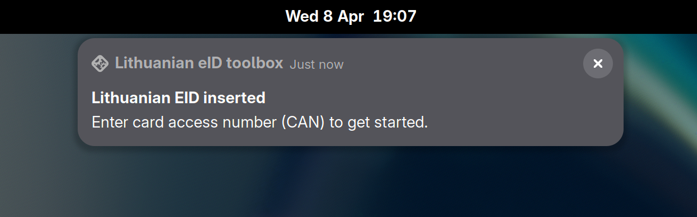
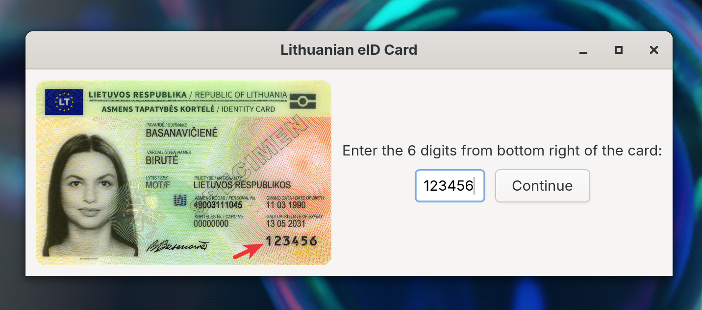
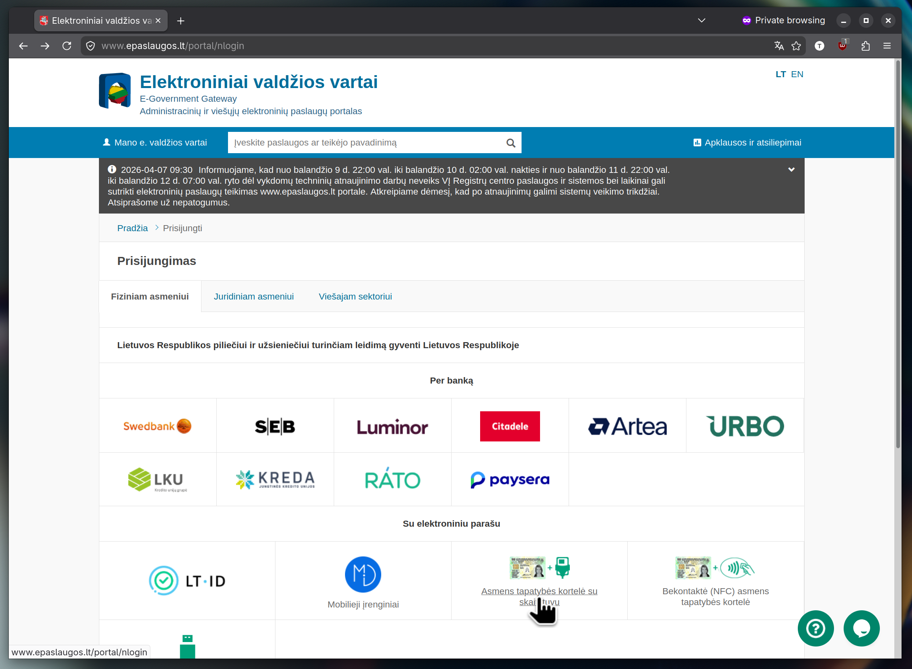
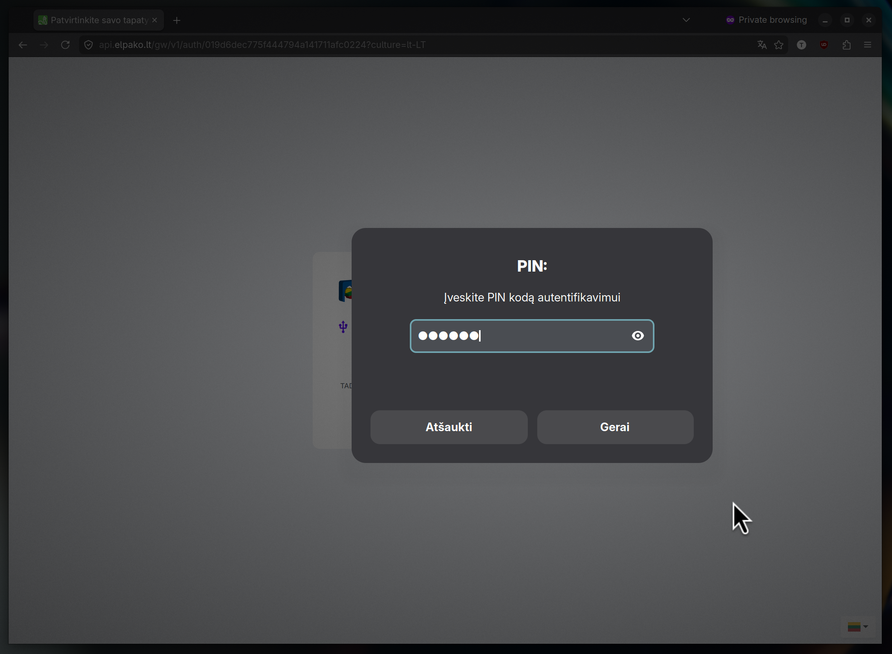

# Kas tai?

Nuo ~2026 Balandžio [OpenSC](https://github.com/OpenSC/OpenSC) projektas turi
`lteid` tvarkyklę palaikančia Lietuvišką asmens tapatybės kortelę. O šioje
repozitorijoje laikau keletą pagalbinių programėlių/servisų Linux darbo
aplinkai, kurios kaip ir netinka būti OpenSC projekto dalimi.

Įspėjimas: kolkas viskas yra neparuošta platesniam naudojimui, jokių garantijų
dėl veikimo/tinkamumo ir t.t. Ką čia matote yra prastai dokumentuoti ir nebaigti
eksperimentai.

## Grafinė programėlė CAN įvedimui

Nuo 2021 metų išduodamos ATK naudoja [PACE](https://en.wikipedia.org/wiki/Supplemental_access_control)
autentifikaciją. Dėl to, prieš pradedant darbą su kortele reikia įvesti taip
vadinamą "card access number" - kortelės prieigos kodą.

`lteid_toolbox` yra programėlė kuri veikia kaip `systemd` servisas. Į usb
skaitytuvą įdejus ATK "iššoks" tokia žinutė:

Spustelėjus tą žinutę atsidarys langas įvesti kortelės prieigos kodą:

Įvedus kodą:

Kodas išsaugomas `~/.cache/opensc` kataloge ir kortelė tampa matoma per
OpenSC PKCS#11 modulį.

## Elpako Signer apsimetantis web servisas

Prisijungimui prie [epaslaugos.lt](https://www.epaslaugos.lt/portal/) reikalinga
papildoma programinė įranga Elpako Signer, kuri tiesa pasakius Linux nelabai
veikia.

`signing_server.py` įgyvendina Elpako Signer web servisą autentifikacijai.

Viską tinkamai sukonfigūravus ir jungiantis per "ATK su skaitytuvu":

Tada paspaudus "Prisijungti":

Iššoka PIN kodo langas:

Įvedus teisingą PIN prisijungiama prie epaslaugos.lt portalo.
